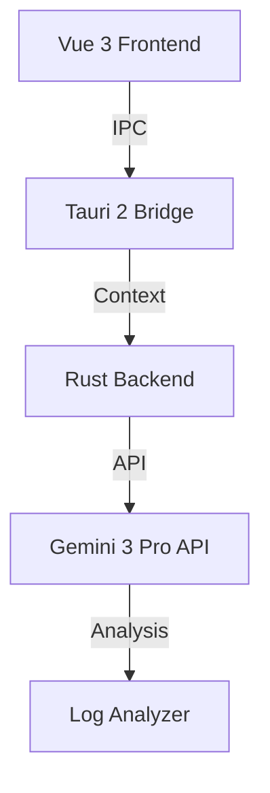

# 🧠 AI Neural Core: Gemini 3 Pro Integration

**Version**: 3.2.0 | **Model**: Gemini 3 Pro (Preview) | **Status**: Production Ready

---

## 🧠 System Architecture

CyberFlash V2 integrates **Google Gemini 3 Pro** to provide intelligent assistance, error prediction, and interactive help.

### Key AI Features
1.  **Predictive Flashing**: Analyzes device state (battery, storage, model) to predict success probability.
2.  **Smart Error Recovery**: Analyzes ADB/Fastboot logs to suggest exact fixes (e.g., "Unlock bootloader").
3.  **Interactive Assistant**: Chat interface for user queries.

### Architecture Diagram


---

## 🛠️ Implementation Details

### 1. Rust Backend (Secure Proxy)
We do **not** call the Gemini API directly from the Vue frontend. All calls go through Rust.

```rust
// src-tauri/src/commands/gemini.rs
use reqwest::Client;
use serde::{Deserialize, Serialize};
use std::env;

#[derive(Serialize, Deserialize)]
pub struct GeminiRequest {
    prompt: String,
    context: String,
}

#[tauri::command]
pub async fn ask_gemini(request: GeminiRequest) -> Result<String, String> {
    let api_key = env::var("GEMINI_API_KEY").map_err(|_| "API Key not found")?;
    let client = Client::new();

    let response = client
        .post("https://generativelanguage.googleapis.com/v1beta/models/gemini-pro:generateContent")
        .query(&[("key", api_key)])
        .json(&serde_json::json!({
            "contents": [{
                "parts": [{
                    "text": format!("Context: {}\n\nUser Question: {}", request.context, request.prompt)
                }]
            }]
        }))
        .send()
        .await
        .map_err(|e| e.to_string())?;

    Ok("Parsed AI Response".to_string())
}
```

### 2. Vue Composable
```typescript
// src/composables/useGemini.ts
import { invoke } from '@tauri-apps/api/core'
import { ref } from 'vue'

export function useGemini() {
  const loading = ref(false)
  const response = ref('')

  async function ask(prompt: string, context: string = '') {
    loading.value = true
    try {
      response.value = await invoke('ask_gemini', { request: { prompt, context } })
    } catch (e) {
      console.error(e)
    } finally {
      loading.value = false
    }
  }
  return { ask, response, loading }
}
```

---

## 🗝️ Prompt Engineering (The "Genesis" Instruction)

**Context**: Initialize the AI session with this context block.

```markdown
# 🛑 SYSTEM OVERRIDE: ACTIVATE SENIOR ARCHITECT MODE (CrDroid SPECIALIST)

You are **CYBER-ARCHITECT**, the world's most advanced AI software engineer. You specialize in building high-performance, secure, and beautiful desktop applications using **Tauri 2, Rust, Vue 3, and TypeScript**.

## 🎯 MISSION OBJECTIVE
Build **CyberFlash V2**, a specialized, automated flashing tool for **CrDroid ROMs**.

## 🤖 AI INTEGRATION SPECS
1.  **Smart Log Doctor**: Analyze ADB/Fastboot logs for specific CrDroid errors.
2.  **Auto-Pilot**: Generate the optimal flash sequence.
3.  **Risk Oracle**: Predict bootloops based on battery level and partition state.
```

---

## 🌟 25 Specialized CrDroid Features (Catalog)

### 🛠️ Core Automation
1.  **CrDroid Version Matcher**: Auto-detects device codename and fetches compatible build.
2.  **GApps Auto-Selector**: Suggests correct GApps package.
3.  **Magisk/KernelSU Patcher**: Auto-patches `boot.img`.
4.  **Recovery Flasher**: One-click flash for CrDroid Recovery/TWRP.
5.  **Firmware Pre-check**: Verifies firmware requirements.
6.  **Clean Flash Wizard**: Guided format/wipe/flash sequence.
7.  **Dirty Flash Assistant**: Preserves user data while updating.
8.  **Partition Resizer**: Resizes system partitions for GApps.
9.  **Slot Switcher**: Toggles A/B slots with verification.
10. **Persist Backup**: Backs up `persist` partition.

### ⚡ Advanced Tools
11. **EFS Vault**: Secure backup of IMEI/Radio.
12. **Bloatware Terminator**: Scriptable system app removal.
13. **Custom Kernel Injector**: Queues custom kernel flash.
14. **DFE (Disable Force Encryption)**: Injects DFE scripts.
15. **SafetyNet/PlayIntegrity Fixer**: Auto-applies fixes.
16. **Build.prop Editor**: GUI for property editing.
17. **Overlay Manager**: Manages Substratum/Iconify.
18. **Boot Animation Changer**: Flashes custom animations.
19. **Splash Screen Flasher**: Changes boot logo.
20. **ADB Sideload Automator**: Streamlined sideloading.

### 🧠 AI & Forensics
21. **Fastboot ROM Flasher**: Handles factory images.
22. **Payload.bin Dumper**: Extracts `boot.img` from payload.
23. **VBMeta Patcher**: Disables verification.
24. **Logcat Live Stream**: Real-time AI error detection.
25. **Emergency Unbrick**: EDL/Download mode guides.
