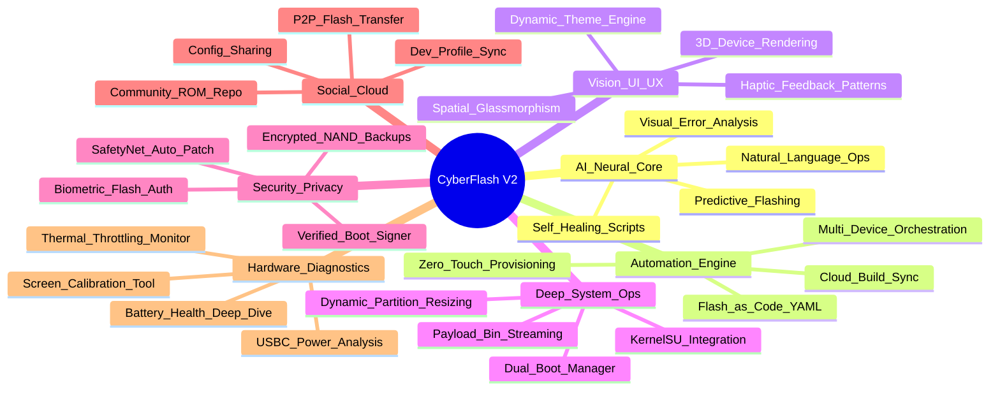

# 🚀 CyberFlash V2: 2026 Feature Roadmap & Innovation Matrix

**Version**: 1.0.0 | **Target Era**: 2025-2026 | **Status**: Visionary Draft
**Theme**: "Autonomous, Intelligent, Spatial"

---

## 🧠 Strategic Mind Map

---

## 📋 The 100+ Innovation Matrix

### 🧠 Category 1: AI & Neural Core (Gemini 3 Pro)
*Intelligent assistance that predicts, fixes, and optimizes.*

| ID | Feature Name | Priority | Complexity | Description |
|:---|:-------------|:---------|:-----------|:------------|
| **AI-01** | **Predictive Success Score** | 🔥 High | 🔴 Hard | Analyzes device state, battery, and ROM version to predict flash success % before starting. |
| **AI-02** | **Log Sentinel** | 🔥 High | 🟡 Med | Real-time parsing of `logcat`/`dmesg` to highlight errors in plain English. |
| **AI-03** | **Auto-Driver Fetch** | ⚡ Med | 🟡 Med | AI identifies missing drivers (Win/Lin) and fetches the exact version automatically. |
| **AI-04** | **Visual Bootloop Doctor** | ⚡ Med | 🔴 Hard | Uses camera/screen analysis to detect bootloops visually and trigger rescue mode. |
| **AI-05** | **Natural Language CLI** | ⚡ Med | 🔴 Hard | Type "Flash the latest Lineage and keep data" -> translates to ADB commands. |
| **AI-06** | **Smart ROM Recommender** | 🧊 Low | 🟢 Easy | Suggests ROMs based on user usage patterns (Gaming vs. Battery vs. Privacy). |
| **AI-07** | **Contextual Help Bot** | ⚡ Med | 🟡 Med | Chatbot aware of current screen/error context (e.g., "Why did Error 7 happen?"). |
| **AI-08** | **Config Generator** | ⚡ Med | 🟡 Med | Generates `flash_config.yaml` from a pasted XDA forum thread URL. |
| **AI-09** | **Brick Prediction** | 🔥 High | 🔴 Hard | Warns if a specific combination of firmware + ROM is known to cause bricks. |
| **AI-10** | **Voice Command Ops** | 🧊 Low | 🔴 Hard | "Hey CyberFlash, reboot to recovery" (Hands-free operation). |
| **AI-11** | **Sentiment Analysis** | 🧊 Low | 🟢 Easy | Analyzes XDA threads for a ROM to gauge stability based on user comments. |
| **AI-12** | **Auto-Translation** | ⚡ Med | 🟡 Med | Translates Chinese/Russian recovery menus to English via OCR overlay. |
| **AI-13** | **Performance Tuner** | ⚡ Med | 🔴 Hard | AI suggests kernel settings based on usage history. |
| **AI-14** | **Battery AI** | ⚡ Med | 🟡 Med | Predicts battery degradation based on charge cycles and flash frequency. |
| **AI-15** | **Network Optimizer** | 🧊 Low | 🟡 Med | Optimizes download mirrors based on real-time speed tests. |

### ⚙️ Category 2: Automation & DevOps
*Streamlining the workflow from download to boot.*

| ID | Feature Name | Priority | Complexity | Description |
|:---|:-------------|:---------|:-----------|:------------|
| **AU-01** | **Flash-as-Code** | 🔥 High | 🟡 Med | Define entire device state in a YAML file (ROM, GApps, Magisk, Modules). |
| **AU-02** | **Zero-Touch Flash** | 🔥 High | 🔴 Hard | Plug in device -> Auto-detect -> Auto-flash pre-defined profile. |
| **AU-03** | **Cloud Build Sync** | ⚡ Med | 🔴 Hard | Connect to GitHub Actions to download artifacts from your own ROM builds. |
| **AU-04** | **Multi-Device Grid** | ⚡ Med | 🔴 Hard | Flash 5+ devices simultaneously (Deployment/Farm mode). |
| **AU-05** | **Payload.bin Stream** | 🔥 High | 🔴 Hard | Extract `boot.img` from `payload.bin` *while downloading* (no full download needed). |
| **AU-06** | **Recovery Script Gen** | ⚡ Med | 🟡 Med | Auto-generate `OpenRecoveryScript` for TWRP automation. |
| **AU-07** | **Magisk Auto-Patch** | 🔥 High | 🟡 Med | Auto-extract `boot.img`, patch with Magisk, and flash back. |
| **AU-08** | **GApps Integrator** | ⚡ Med | 🟢 Easy | Auto-select correct GApps package (ARM64/Android 16) for the ROM. |
| **AU-09** | **Firmware Matcher** | 🔥 High | 🟡 Med | Enforce firmware requirements (e.g., "Must be on OOS 12 before flashing"). |
| **AU-10** | **Backup Scheduler** | ⚡ Med | 🟡 Med | Auto-backup `data` partition every time device is connected. |
| **AU-11** | **Module Manager** | ⚡ Med | 🟢 Easy | Drag-and-drop Magisk/KernelSU modules to install queue. |
| **AU-12** | **APK Batch Installer** | 🧊 Low | 🟢 Easy | Restore 100+ apps via ADB after clean flash. |
| **AU-13** | **Debloat Presets** | ⚡ Med | 🟢 Easy | One-click removal of bloatware lists (Samsung, Xiaomi, OnePlus). |
| **AU-14** | **Prop Editor** | ⚡ Med | 🟡 Med | GUI for editing `build.prop` before flashing. |
| **AU-15** | **Slot Switcher** | 🔥 High | 🟢 Easy | Visual A/B slot toggle with "Copy Slot" function. |

### 🎨 Category 3: Vision UI/UX (2026 Design)
*Immersive, spatial, and responsive interface.*

| ID | Feature Name | Priority | Complexity | Description |
|:---|:-------------|:---------|:-----------|:------------|
| **UI-01** | **Spatial Glass** | 🔥 High | 🟡 Med | UI elements float with depth (parallax) and background blur (backdrop-filter). |
| **UI-02** | **3D Device Render** | 🔥 High | 🔴 Hard | Real-time 3D model of connected device (rotatable) showing status. |
| **UI-03** | **Haptic Patterns** | ⚡ Med | 🟡 Med | Distinct vibration patterns for Success, Error, and Waiting (Controller/Phone). |
| **UI-04** | **Mesh Gradients** | ⚡ Med | 🟢 Easy | Dynamic, flowing background gradients that react to mouse movement. |
| **UI-05** | **Terminal Glass** | ⚡ Med | 🟢 Easy | Transparent terminal overlay that blurs content behind it. |
| **UI-06** | **Focus Mode** | 🧊 Low | 🟢 Easy | Dims everything except the progress bar during critical flash ops. |
| **UI-07** | **Theme Sync** | ⚡ Med | 🟡 Med | App theme adapts to the wallpaper of the connected Android device. |
| **UI-08** | **Gesture Controls** | 🧊 Low | 🟡 Med | Swipe gestures for navigation (if using touch screen/trackpad). |
| **UI-09** | **Soundscapes** | 🧊 Low | 🟢 Easy | Ambient audio during long flash processes (Cyberpunk/Zen vibes). |
| **UI-10** | **Compact Overlay** | ⚡ Med | 🟡 Med | Mini-window mode that stays on top (PiP) monitoring progress. |
| **UI-11** | **Visual Partition Map** | ⚡ Med | 🟡 Med | Pie chart visualization of partition sizes and usage. |
| **UI-12** | **Retro Mode** | 🧊 Low | 🟢 Easy | "Matrix" or "Terminal Green" skin for nostalgia. |
| **UI-13** | **OLED Black** | ⚡ Med | 🟢 Easy | True black theme for battery saving on OLED displays. |
| **UI-14** | **Custom Icons** | 🧊 Low | 🟢 Easy | Allow users to replace device icons with custom PNGs. |
| **UI-15** | **Confetti Blast** | 🧊 Low | 🟢 Easy | Particle effects on successful flash completion. |

### 🛡️ Category 4: Security & Privacy
*Protecting data and ensuring integrity.*

| ID | Feature Name | Priority | Complexity | Description |
|:---|:-------------|:---------|:-----------|:------------|
| **SEC-01** | **Verified Boot Signer** | 🔥 High | 🔴 Hard | Re-sign custom ROMs with user keys to lock bootloader safely. |
| **SEC-02** | **SafetyNet Fixer** | 🔥 High | 🟡 Med | Auto-apply Universal SafetyNet Fix / Play Integrity bypass. |
| **SEC-03** | **EFS Backup Guard** | 🔥 High | 🟡 Med | Force EFS/IMEI backup before allowing any wipe operation. |
| **SEC-04** | **Encrypted Backups** | ⚡ Med | 🟡 Med | AES-256 encryption for local ADB backups. |
| **SEC-05** | **Malware Scan** | ⚡ Med | 🟡 Med | Scan APKs/Zips for known malware signatures before flashing. |
| **SEC-06** | **Privacy Dashboard** | ⚡ Med | 🟢 Easy | Audit which apps have sensitive permissions via ADB. |
| **SEC-07** | **Kill Switch** | 🧊 Low | 🟢 Easy | "Panic Button" to sever ADB connection immediately. |
| **SEC-08** | **USB Firewall** | ⚡ Med | 🔴 Hard | Block unauthorized USB data access while charging. |
| **SEC-09** | **Bootloader Locker** | ⚡ Med | 🔴 Hard | Guided wizard to safely re-lock bootloader (Pixel/OnePlus). |
| **SEC-10** | **Hash Verifier** | 🔥 High | 🟢 Easy | Auto-verify MD5/SHA256 of downloaded files against source. |
| **SEC-11** | **Incognito Mode** | 🧊 Low | 🟢 Easy | Don't log history or save device serial numbers. |
| **SEC-12** | **Sudo Gatekeeper** | ⚡ Med | 🟡 Med | Require biometric/password auth for critical commands (Wipe Data). |
| **SEC-13** | **App Locker** | 🧊 Low | 🟢 Easy | Disable/Freeze apps via ADB without uninstalling. |
| **SEC-14** | **DNS Overrider** | 🧊 Low | 🟡 Med | Force device to use specific DNS servers via ADB. |
| **SEC-15** | **Proxy Tunnel** | 🧊 Low | 🔴 Hard | Route device traffic through PC proxy via reverse tethering. |

### ☁️ Category 5: Social & Cloud
*Connecting the modding community.*

| ID | Feature Name | Priority | Complexity | Description |
|:---|:-------------|:---------|:-----------|:------------|
| **SOC-01** | **Community Repo** | 🔥 High | 🔴 Hard | Built-in browser for XDA/Telegram releases (curated). |
| **SOC-02** | **P2P Transfer** | ⚡ Med | 🔴 Hard | Send ROM zip from PC to PC via WebRTC (no upload needed). |
| **SOC-03** | **Config Sharing** | ⚡ Med | 🟢 Easy | "Share my Setup" link (generates JSON of ROM+Modules+Kernel). |
| **SOC-04** | **Dev Profiles** | 🧊 Low | 🟢 Easy | Follow favorite developers and get notified of updates. |
| **SOC-05** | **Build Server** | 🧊 Low | 🔴 Hard | Rent cloud GPU to compile LineageOS for your device. |
| **SOC-06** | **Review System** | ⚡ Med | 🟡 Med | User ratings for ROM stability/battery life. |
| **SOC-07** | **Issue Tracker** | ⚡ Med | 🟡 Med | Report bugs directly to ROM maintainer via GitHub API. |
| **SOC-08** | **Remote Flash** | 🧊 Low | 🔴 Hard | Allow a trusted friend to control your flasher remotely (TeamViewer style). |
| **SOC-09** | **Stats Dashboard** | 🧊 Low | 🟢 Easy | Global stats: "Most flashed ROM this week". |
| **SOC-10** | **Donation Links** | 🧊 Low | 🟢 Easy | Direct links to donate to ROM maintainers. |

### 🔧 Category 6: Deep System Ops
*Advanced tools for power users.*

| ID | Feature Name | Priority | Complexity | Description |
|:---|:-------------|:---------|:-----------|:------------|
| **SYS-01** | **Partition Resizer** | 🔥 High | 🔴 Hard | GUI to resize `system`/`userdata` (Dynamic Partitions). |
| **SYS-02** | **Dual Boot Mgr** | ⚡ Med | 🔴 Hard | Setup dual boot (e.g., MIUI + AOSP) using A/B slots. |
| **SYS-03** | **EDL Firehose** | 🔥 High | 🔴 Hard | Qualcomm EDL flashing support (requires programmer files). |
| **SYS-04** | **Mediatek SP** | ⚡ Med | 🔴 Hard | MediaTek SP Flash Tool integration. |
| **SYS-05** | **Kernel Flasher** | ⚡ Med | 🟡 Med | Flash `boot.img`/`dtbo.img`/`vendor_boot.img` separately. |
| **SYS-06** | **Super Image Packer** | ⚡ Med | 🔴 Hard | Unpack/Repack `super.img` (Dynamic Partitions). |
| **SYS-07** | **DSU Loader** | ⚡ Med | 🟡 Med | Install GSI via Dynamic System Updates (DSU) easily. |
| **SYS-08** | **Logcat Filter** | ⚡ Med | 🟡 Med | Advanced regex filtering for logcat (exclude noise). |
| **SYS-09** | **Screen Record** | 🧊 Low | 🟢 Easy | Record device screen via ADB at high bitrate. |
| **SYS-10** | **Resolution Changer** | 🧊 Low | 🟢 Easy | Change DPI/Resolution via ADB (safe mode fallback). |
| **SYS-11** | **Fstrim Trigger** | 🧊 Low | 🟢 Easy | Manually trigger fstrim to improve storage speed. |
| **SYS-12** | **Battery Calibrator** | 🧊 Low | 🟢 Easy | Reset `batterystats.bin` (placebo or not, users want it). |
| **SYS-13** | **Sensor Test** | 🧊 Low | 🟡 Med | Read raw sensor data via ADB. |
| **SYS-14** | **Key Mapper** | 🧊 Low | 🟡 Med | Remap hardware keys via ADB overlay. |
| **SYS-15** | **Overlay Manager** | ⚡ Med | 🟡 Med | Manage RRO/OMS overlays (Substratum style). |

### 🔌 Category 7: Hardware & Diagnostics
*Physical layer analysis.*

| ID | Feature Name | Priority | Complexity | Description |
|:---|:-------------|:---------|:-----------|:------------|
| **HW-01** | **Cable Tester** | 🔥 High | 🟡 Med | Measure data transfer speed to rate USB cable quality. |
| **HW-02** | **Power Monitor** | ⚡ Med | 🟡 Med | Graph charging wattage/voltage/amperage in real-time. |
| **HW-03** | **Storage Health** | ⚡ Med | 🟡 Med | Read UFS/eMMC health indicators (Life Left %). |
| **HW-04** | **Thermal Monitor** | ⚡ Med | 🟢 Easy | Graph CPU/Battery temperature during flashing. |
| **HW-05** | **Panel Info** | 🧊 Low | 🟢 Easy | Detect exact screen panel model (Samsung/BOE/Tianma). |
| **HW-06** | **Battery Cycles** | ⚡ Med | 🟢 Easy | Read exact charge cycle count from kernel. |
| **HW-07** | **CPU Binning** | 🧊 Low | 🟡 Med | Read CPU binning info (silicon quality). |
| **HW-08** | **Water Detect** | 🧊 Low | 🔴 Hard | Check moisture sensors (if exposed via kernel). |
| **HW-09** | **Speaker Test** | 🧊 Low | 🟢 Easy | Play frequency sweep to test speakers. |
| **HW-10** | **Pixel Dead Check** | 🧊 Low | 🟢 Easy | Cycle full screen colors to find dead pixels. |

---

## 📅 Implementation Timeline

### Phase 1: The Foundation (Q1 2025)
*   **Focus**: Core Flashing, Basic AI, UI 1.0
*   **Key Features**: AI-01, AU-01, UI-01, SEC-03.

### Phase 2: The Intelligence (Q3 2025)
*   **Focus**: Advanced AI, Cloud Integration
*   **Key Features**: AI-02, AI-05, SOC-01, AU-03.

### Phase 3: The Ecosystem (2026)
*   **Focus**: Hardware Ops, Social, Advanced Security
*   **Key Features**: HW-01, SOC-02, SEC-01, SYS-03.
