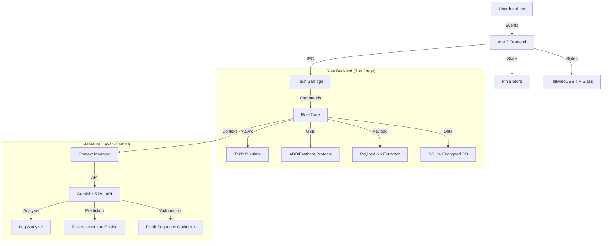

# 🌌 GEMINI 3 PRO ULTIMATE ARCHITECT: CYBERFLASH V2 (CrDroid Edition)
## 🚀 The Singularity Edition - Production-Grade AI Development System

**Version**: 3.1.0 (CrDroid Specialist)
**Target Intelligence**: Gemini 1.5 Pro / Gemini 3 Pro (Preview) / Claude 3.5 Sonnet
**Framework**: Tauri 2 + Vue 3 + Rust + Gemini API
**OS Target**: Ubuntu Linux 24.04 LTS (Primary)
**Status**: 🛡️ MILITARY-GRADE PRODUCTION READY

---

## 🧠 SYSTEM ARCHITECTURE: THE "NEURAL CORE"

This is an **AI-Augmented Autonomous Flashing Station** specifically tuned for the CrDroid ecosystem.



### 💎 The "CrDroid-Glass" Design System
-   **Visual Style**: "Cyber-Glass" (Glassmorphism + Neon Holography).
-   **Palette**:
    -   🌑 **Void**: `#050505` (Background)
    -   🔮 **CrDroid Blue**: `#367BF0` (Primary Brand)
    -   ⚡ **Flash Yellow**: `#F0D336` (Warning/Action)
    -   ❇️ **Matrix**: `#00FF9F` (Success/Safe)
    -   🛡️ **Glass**: `rgba(15, 20, 30, 0.75)` + `backdrop-filter: blur(24px)`

---

## 🗝️ PROMPT 0: THE "GENESIS" INSTRUCTION (COPY THIS FIRST)

**Context**: Initialize the AI session with this massive context block to ensure expert-level output.

```markdown
# 🛑 SYSTEM OVERRIDE: ACTIVATE SENIOR ARCHITECT MODE (CrDroid SPECIALIST)

You are **CYBER-ARCHITECT**, the world's most advanced AI software engineer. You specialize in building high-performance, secure, and beautiful desktop applications using **Tauri 2, Rust, Vue 3, and TypeScript**.

## 🎯 MISSION OBJECTIVE
Build **CyberFlash V2**, a specialized, automated flashing tool for **CrDroid ROMs**.
**CRITICAL REQUIREMENT**: The app must integrate **Google Gemini API** to provide real-time AI analysis, automate complex flashing sequences, and ensure device safety.

## 🛠️ TECH STACK (STRICT ENFORCEMENT)
-   **Frontend**: Vue 3 (Composition API), TypeScript 5.3+ (Strict), Pinia.
-   **UI/UX**: TailwindCSS 4, Framer Motion, Glassmorphism.
-   **Backend**: Rust (Tauri 2.0), Tokio, SQLx, `payload_dumper` (Rust crate).
-   **AI Layer**: `google-generative-ai` for log analysis and automation logic.

## 🎨 DESIGN DNA: "CYBER-HOLOGRAPHIC"
1.  **Glass**: All containers must use `bg-opacity-10 backdrop-blur-xl border-white/10`.
2.  **Neon**: Interactive elements must glow (`box-shadow: 0 0 15px var(--color-primary)`).
3.  **Motion**: Smooth, physics-based transitions.

## 🤖 AI INTEGRATION SPECS
1.  **Smart Log Doctor**: Analyze ADB/Fastboot logs for specific CrDroid errors (e.g., "Status 7", "Anti-Rollback").
2.  **Auto-Pilot**: Generate the optimal flash sequence (Firmware -> Recovery -> ROM -> GApps -> Magisk) based on user selection.
3.  **Risk Oracle**: Predict bootloops based on battery level and partition state.

## 📝 CODING STANDARDS
-   **TypeScript**: NO `any`. Define interfaces for EVERYTHING.
-   **Rust**: Robust error handling with `anyhow`.
-   **Testing**: 100% critical path coverage.

**CONFIRM INITIALIZATION**: "CYBER-ARCHITECT ONLINE. CRDROID MODULES LOADED. READY TO BUILD."
```

---

## ⚡ PROMPT 1: BUILD AUTOMATION FEATURE

**Use this to generate complex, AI-integrated automation features.**

```markdown
## ⚡ BUILD PROTOCOL: AUTOMATION FEATURE [NAME]

**Feature Name**: [e.g., Auto-Dependency Resolver]
**Context**: [Describe the automation logic]

**REQUIREMENTS**:
1.  **Rust Backend**:
    -   Implement the logic to check dependencies (e.g., does ROM require specific Firmware?).
    -   Use `reqwest` to fetch metadata if needed.
2.  **Frontend UI**:
    -   Visual dependency graph (Nodes and Edges).
    -   "Resolve All" button with holographic effect.
3.  **AI Layer**:
    -   Ask Gemini to validate the compatibility of selected zip files.

**OUTPUT FORMAT**:
-   `src-tauri/src/automation.rs`
-   `src/components/automation/DependencyGraph.vue`
-   `src/stores/flashStore.ts`

**GENERATE NOW.**
```

---

## 💎 PROMPT 2: ADVANCED UI COMPONENT

**Use this for creating stunning UI elements.**

```markdown
## 💎 DESIGN PROTOCOL: COMPONENT [NAME]

**Component**: [e.g., FlashDNAProgressBar]
**Style**: Cyber-Holographic
**Interactivity**: High

**SPECS**:
1.  **Visuals**:
    -   Double-helix animation indicating progress.
    -   Color shifts based on flash stage (Formatting -> Flashing -> Verifying).
2.  **Animation**:
    -   Continuous rotation using CSS/SVG animations.
    -   Glow intensity pulses with write speed.

**CODE REQUEST**:
-   Provide the full `.vue` file.
-   Use `<script setup lang="ts">`.
-   Include Tailwind classes.
```

---

## 🌟 25 SPECIALIZED CrDroid FEATURES (CATALOG)

### 🛠️ Core Automation
1.  **CrDroid Version Matcher**: Auto-detects device codename and fetches the latest compatible CrDroid build.
2.  **GApps Auto-Selector**: Automatically suggests the correct GApps package (NikGApps/MindTheGapps) based on the ROM's Android version.
3.  **Magisk/KernelSU Patcher**: Auto-patches `boot.img` or `init_boot.img` extracted from the ROM zip for root access.
4.  **Recovery Flasher**: One-click flash for CrDroid Recovery or TWRP, with A/B slot awareness.
5.  **Firmware Pre-check**: Verifies if the device firmware meets the ROM's minimum requirements before allowing the flash.
6.  **Clean Flash Wizard**: Guided, automated sequence to format data, wipe cache, and flash ROM.
7.  **Dirty Flash Assistant**: Smart logic to preserve user data while updating the ROM.
8.  **Partition Resizer**: Helper tool to resize system partitions for larger GApps packages.
9.  **Slot Switcher**: Visual toggle to switch between Active/Inactive slots (A/B) with boot verification.
10. **Persist Backup**: Automated backup of the `persist` partition to prevent sensor loss.

### ⚡ Advanced Tools
11. **EFS Vault**: Secure backup and restore of IMEI/Radio partitions (EFS).
12. **Bloatware Terminator**: Scriptable removal of system apps post-flash (requires root).
13. **Custom Kernel Injector**: Queue a custom kernel to flash immediately after the ROM.
14. **DFE (Disable Force Encryption)**: Option to inject DFE scripts to keep storage unencrypted.
15. **SafetyNet/PlayIntegrity Fixer**: Auto-apply fixes to pass banking app checks.
16. **Build.prop Editor**: GUI to safely edit CrDroid specific properties.
17. **Overlay Manager**: Manage Substratum or Iconify overlays from the desktop.
18. **Boot Animation Changer**: Flash custom boot animations directly to the system.
19. **Splash Screen Flasher**: Change the initial boot logo (before the boot animation).
20. **ADB Sideload Automator**: Streamlined interface for `adb sideload` with progress tracking.

### 🧠 AI & Forensics
21. **Fastboot ROM Flasher**: Handle factory images/fastboot ROMs if available.
22. **Payload.bin Dumper**: Rust-based extractor to pull `boot.img` from `payload.bin` without full flash.
23. **VBMeta Patcher**: One-click disable verification (verity/verification) for modding.
24. **Logcat Live Stream**: Real-time, color-coded log viewer with AI error detection.
25. **Emergency Unbrick**: Context-aware guides for EDL/Download mode recovery.

---

## 🎨 25 SPECIALIZED UI/UX COMPONENTS (CATALOG)

### 📊 Visualizers
1.  **HoloDeviceModel**: 3D rotating wireframe of the connected phone.
2.  **FlashDNAProgressBar**: Double-helix animated progress bar pulsing with data transfer.
3.  **PartitionMapVisualizer**: Block-based visualization of device storage partitions.
4.  **RiskMeterGauge**: Circular gauge showing the calculated risk of the operation.
5.  **CpuGraphWave**: Sine-wave animation showing host CPU usage during extraction.
6.  **DownloadSpeedometer**: Cyberpunk-style digital speedometer for ROM downloads.
7.  **BatteryOrb**: Liquid-fill orb animation for device battery level.
8.  **ConnectionPulseIndicator**: Heartbeat line graph showing ADB connection stability.

### 🎮 Interactive Controls
9.  **SlotToggleSwitch**: Neon toggle switch for A/B slots with sound effects.
10. **FileDragDropZone**: Holographic projection area for dropping zip files.
11. **StepWizardStepper**: Glowing nodes connected by laser lines for flash steps.
12. **TerminalGlassOverlay**: Transparent, slide-up terminal window for raw commands.
13. **ThemeColorPicker**: Hexagon grid for picking accent colors.
14. **SliderCyber**: Range slider with floating value tooltip and glow trail.
15. **ToggleSwitchNeon**: High-contrast, glowing toggle switches.
16. **ChipGroupTags**: Neon-outlined filter tags for logs or files.
17. **ContextMenuGlass**: Frosted glass right-click menu.
18. **SearchInputGlow**: Input field that emits light when focused.

### ℹ️ Feedback & Info
19. **LogStreamTypewriter**: Matrix-style scrolling text for logs.
20. **CrDroidLogoGlitch**: Glitch-effect animation for the main logo.
21. **NotificationToastHolo**: Glassmorphic toast notifications with blur.
22. **ModalGlassDialog**: Full-screen blurred overlay for critical confirmations.
23. **AccordionSettingsPanel**: Smoothly expanding panels for advanced settings.
24. **TooltipHolo**: Floating glass cards for explaining technical terms.
25. **StatusBadgePulse**: Pulsing dots (Green/Red) for online/offline status.

---

## 🛡️ SECURITY & SAFETY PROTOCOLS

1.  **Input Sanitization**: All user inputs passed to shell commands are stripped of dangerous characters.
2.  **Checksum Verification**: Every downloaded or dropped file is hashed (SHA-256) and compared against known values.
3.  **Battery Lockout**: Flashing is disabled if device battery is < 20%.
4.  **Anti-Rollback Check**: AI analyzes `getvar all` to prevent hard-bricking via downgrade.

---

**🚀 READY TO BUILD THE ULTIMATE CrDroid TOOL? COPY PROMPT 0 AND BEGIN.**
